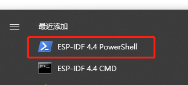

# 编译环境

### 安装 esp 工具链

cargo install espup

espup install

### 安装 esp idf 环境 (可选)

https://dl.espressif.com/dl/esp-idf/

我选择的版本是 v4.4

## 编译

如果前面安装了 esp idf 环境, 使用这个工具 打开终端, 会自动配置好 idf环境:

如果没有这个 idf环境, 就会自动下载完整的 idf环境 到项目根路径的 .embuild目录

cd 到该项目路径

cargo run

cargo run --features wifi

会自动通过串口下载, 如果存在多个串口, 就会提示选择串口下载

# EC11 旋转编码器

快速旋转时 存在抖动, 软件上简单地去除了1ms内的抖动, 还存在无法去除的抖动, 这交给硬件电路处理
